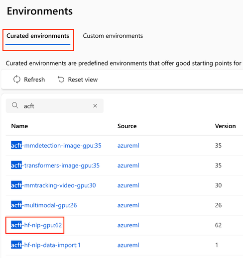
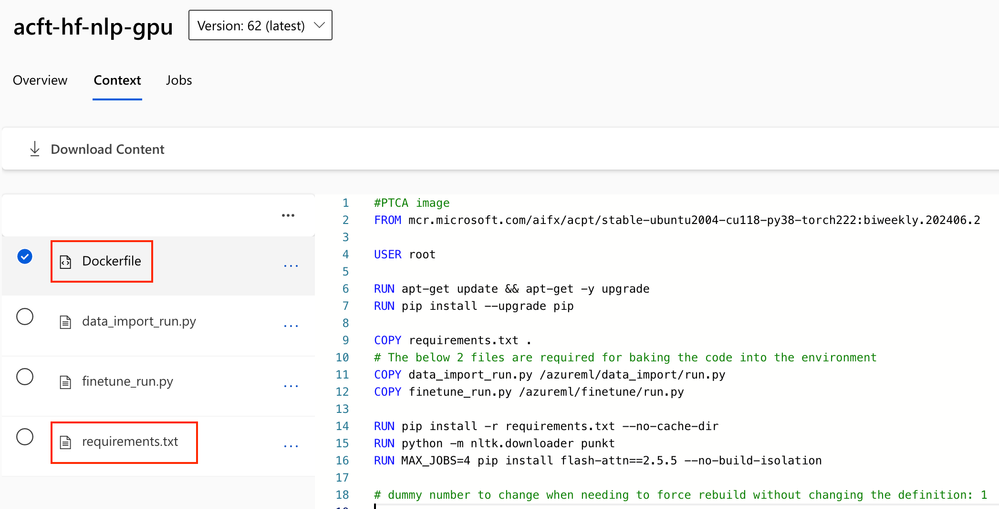
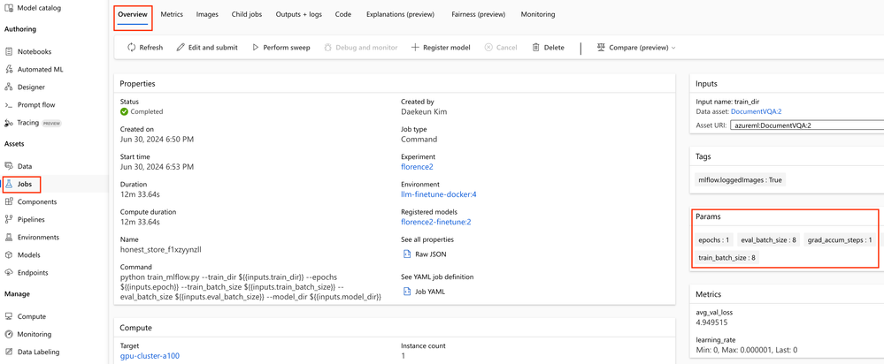
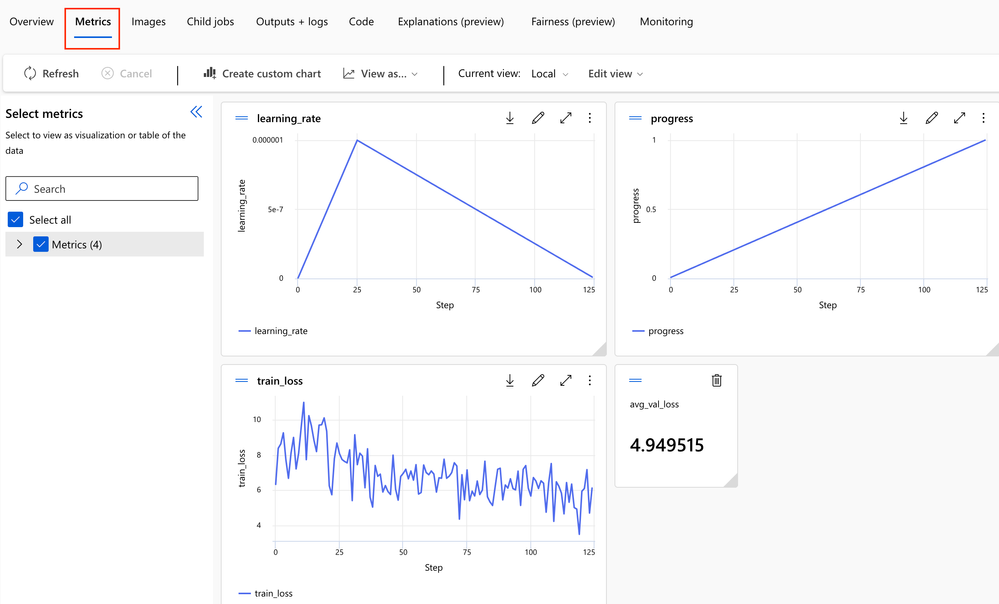
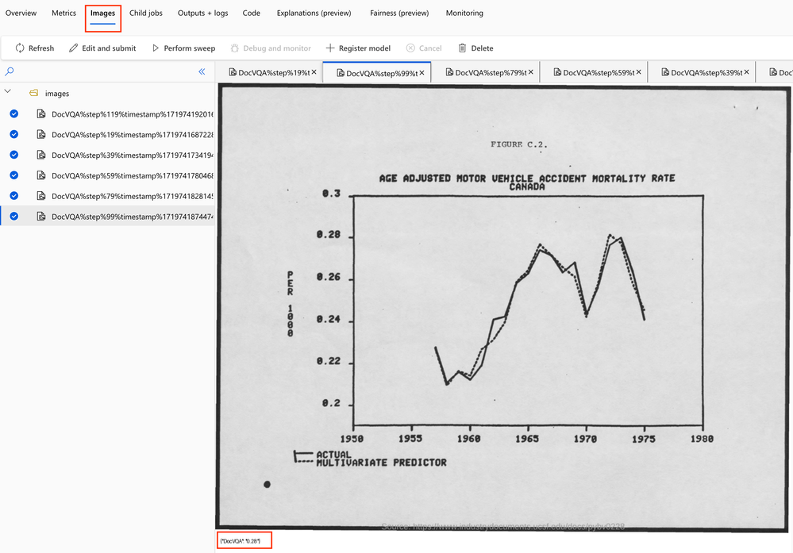
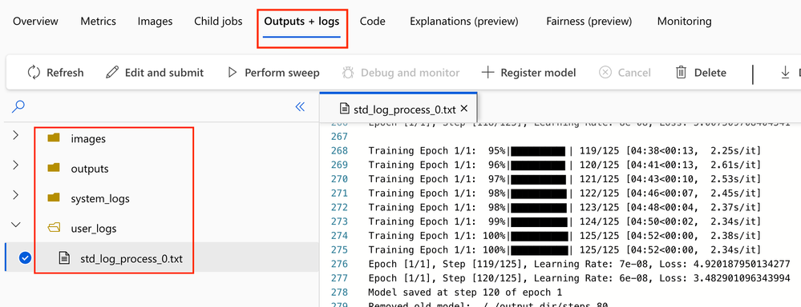

# SLM/LLM Fine-tuning on Azure ML Studio

{: .no_toc }

## Table of contents

{: .no_toc .text-delta }

1. TOC
   {:toc}

---

## 1. How to get started

1. Create your compute instance. For code development, we recommend `Standard_DS11_v2` (2 cores, 14GB RAM, 28GB storage, No GPUs).
2. Open the terminal of the CI and run:
    ```shell
    git clone https://github.com/Azure/slm-innovator-lab.git
    conda activate azureml_py310_sdkv2
    pip install -r requirements.txt
    ```
3. Choose the model to use for your desired use case.
    - [Phi-3, Phi-3.5](phi3)
        - [Option 1. MLflow] Run [`1_training_mlflow.ipynb`](phi3/1_training_mlflow.ipynb) and [`2_serving.ipynb`](phi3/2_serving.ipynb), respectively.
        - [Option 2. Custom] Run [`1_training_custom.ipynb`](phi3/1_training_custom.ipynb) and [`2_serving.ipynb`](phi3/2_serving.ipynb), respectively.
        - _(Optional)_ If you are interested in LLM dataset preprocessing, see the hands-ons in `phi3/dataset-preparation` folder.
    - [Florence2-VQA](florence2-VQA)
        - Run [`1_training_mlflow.ipynb`](florence2-VQA/1_training_mlflow.ipynb) and [`2_serving.ipynb`](florence2-VQA/2_serving.ipynb), respectively.
    - Don't forget to edit the `config.yml`.

## 2. Azure ML Training preparation

### 2.1. Preliminaries: Azure ML Python SDK v2

Azure ML Python SDK v2 is easy to use once you get the hang of it. When an `MLClient` instance is created to manipulate AzureML, the operation corresponding to the asset is executed asynchronously through the `create_or_update function`. Please see code snippets below.

```python
ml_client = MLClient.from_config(credential)

### 1. Training phase
# Create an environment asset
ml_client.environments.create_or_update(env_docker_image)

# Create a data asset
ml_client.data.create_or_update(data)

# Create a compute cluster
ml_client.compute.begin_create_or_update(compute)

# Start a training job
ml_client.jobs.create_or_update(job)

### 2. Serving phase
# Create a model asset
ml_client.models.create_or_update(run_model)

# Create an endpoint
ml_client.begin_create_or_update(endpoint)

# Create a deployment
ml_client.online_endpoints.begin_create_or_update(endpoint)
```

### 2.2. Data asset

Model training/validation datasets can be uploaded directly locally, or registered as your Azure ML workspace Data asset. Data asset enables versioning of your data, allowing you to track changes to your dataset and revert to previous versions when necessary. This maintains data quality and ensures reproducibility of data analysis.

Data assets are created by referencing data files or directories stored in Datastore. Datastore represents a location that stores external data and can be connected to various Azure data storage services such as Azure Blob Storage, Azure File Share, Azure Data Lake Storage, and OneLake. When you create an Azure ML workspace, four datastores (`workspaceworkingdirectory`, `workspaceartifactstore`, `workspacefilestore`, `workspaceblobstore`) are automatically created by default. Among these, workspaceblobstore is Azure Blob Storage, which is used by default when storing model training data or large files.

### 2.3. Environment asset

Azure ML defines Environment Asset in which your code will run. We can use the built-in environment or build a custom environment using Conda specification or Docker image. The pros and cons of Conda and Docker are as follows.

**Conda environment**

-   Advantages
    -   Simple environment setup: The Conda environment file (conda.yml) is mainly used to specify Python packages and Conda packages. The file format is simple and easy to understand, and is suitable for specifying package and version information.
    -   Quick setup: The Conda environment automatically manages dependencies and resolves conflicts, so setup is relatively quick and easy.
    -   Lightweight environment: Conda environments can be lighter than Docker images because they only install specific packages.
-   Disadvantages
    -   Limited flexibility: Because the Conda environment focuses on Python packages and Conda packages, it is difficult to handle more complex system-level dependencies.
    -   Portability limitations: The Conda environment consists primarily of Python and Conda packages, making it difficult to include other languages or more complex system components.

**Docker environment**

-   Advantages
    -   High flexibility: Docker allows you to define a complete environment, including all necessary packages and tools, starting at the operating system level. May contain system dependencies, custom settings, non-Python packages, etc.
    -   Portability: Docker images run the same everywhere, ensuring environment consistency. This significantly improves reproducibility and portability.
    -   Complex environment setup: With Docker, you can set up an environment containing complex applications or multiple services.
-   Disadvantages
    -   Complex setup: Building and managing Docker images can be more complex than setting up a Conda environment. You need to write a Dockerfile and include all required dependencies.
    -   Build time: Building a Docker image for the first time can take a long time, especially if the dependency installation process is complex.

In Azure ML, it is important to choose the appropriate method based on the requirements of your project. For simple Python projects, the Conda environment may be sufficient, but if you need complex system dependencies, the Docker environment may be more appropriate. The easiest and fastest way to create a custom Docker image is to make minor modifications to the curated environment. Below is an example.

Please select `acft-hf-nlp-gpu` in the curated environment tab. (Of course, you can choose a different environment.)



Please copy the `Dockerfile` and `requirements.txt` and modify them as needed.



The code snippet below is the result of modifying the `Dockerfile`.

```Dockerfile
FROM mcr.microsoft.com/aifx/acpt/stable-ubuntu2004-cu118-py38-torch222:biweekly.202406.2

USER root

RUN apt-get update && apt-get -y upgrade
RUN pip install --upgrade pip

COPY requirements.txt .
RUN pip install -r requirements.txt --no-cache-dir

RUN python -m nltk.downloader punkt
RUN MAX_JOBS=4 pip install flash-attn==2.5.9.post1 --no-build-isolation
```

## 3. Azure ML Training

### 3.1. Training Script with MLflow

Some people may think that they need to make significant changes to their existing training scripts or that the Mlflow toolkit is mandatory, but this is not true. If you are comfortable with your existing training environment, you don't need to adopt Mlflow. Nevertheless, Mlflow is a toolkit that makes training and deploying models on Azure ML very convenient, so we are going to briefly explain it in this post.

In the your training script, Use `mlflow.start_run()` to start an experiment in MLflow, and `mlflow.end_run()` to end the experiment when it is finished. Wrapping it in with syntax eliminates the need to explicitly call end_run(). You can perform mlflow logging inside an mlflow block, our training script uses `mlflow.log_params()`, `mlflow.log_metric()`, and `mlflow.log_image()`. For more information, please see [here](https://learn.microsoft.com/en-us/azure/machine-learning/how-to-log-view-metrics?view=azureml-api-2&tabs=interactive).

```python
import mlflow
...
with mlflow.start_run() as run:
  mlflow.log_params({
    "epochs": epochs,
    "train_batch_size": args.train_batch_size,
    "eval_batch_size": args.eval_batch_size,
    "seed": args.seed,
    "lr_scheduler_type": args.lr_scheduler_type,
    "grad_accum_steps": grad_accum_steps,
    "num_training_steps": num_training_steps,
    "num_warmup_steps": num_warmup_steps,
  })

  # Your training code
  for epoch in range(epochs):
    train_loss = 0.0
    optimizer.zero_grad()

    for step, (inputs, answers) in enumerate(tqdm(train_loader, desc=f"Training Epoch {epoch + 1}/{epochs}")):
      ...
      mlflow.log_metric("train_loss", train_loss)
      mlflow.log_metric("learning_rate", learning_rate)
      mlflow.log_metric("progress", progress)
      ...
      if (step + 1) % save_steps == 0:
        # Log image
        idx = random.randrange(len(val_dataset))
        val_img = val_dataset[idx][-1]
        result = run_example("DocVQA", 'What do you see in this image?', val_dataset[idx][-1])
        val_img_result = create_image_with_text(val_img, json.dumps(result))
        mlflow.log_image(val_img_result, key="DocVQA", step=step)
```

{: .warning}
Some SLMs/LLMs do not support `mlflow.transformers.log_model()`, so we recommend you save the model with the traditional `save_pretrained()`.

```python
model.save_pretrained(model_dir)
processor.save_pretrained(model_dir)
```

### 3.2. Create a Compute Cluster and Training Job

Once you have finished writing and debugging the training script, you can create a training job. As a baseline, you can use `Standard_NC24ads_A100_v4` with one NVIDIA A100 GPU. Provisioning a LowPriority VM costs just $0.74 per hour in the US East region in Sep. 2024.

The `command()` function is one of the Azure ML main functions used to define and run training tasks. This function specifies the training script and its required environment settings, and allows the job to be run on Azure ML's compute resources.

```python
from azure.ai.ml import command
from azure.ai.ml import Input
from azure.ai.ml.entities import ResourceConfiguration

job = command(
    inputs=dict(
        #train_dir=Input(type="uri_folder", path=DATA_DIR), # Get data from local path
        train_dir=Input(path=f"{AZURE_DATA_NAME}@latest"),  # Get data from Data asset
        epoch=d['train']['epoch'],
        train_batch_size=d['train']['train_batch_size'],
        eval_batch_size=d['train']['eval_batch_size'],
        model_dir=d['train']['model_dir']
    ),
    code="./src_train",  # local path where the code is stored
    compute=azure_compute_cluster_name,
    command="python train_mlflow.py --train_dir ${{inputs.train_dir}} --epochs ${{inputs.epoch}} --train_batch_size ${{inputs.train_batch_size}} --eval_batch_size ${{inputs.eval_batch_size}} --model_dir ${{inputs.model_dir}}",
    #environment="azureml://registries/azureml/environments/acft-hf-nlp-gpu/versions/61", # Use built-in Environment asset
    environment=f"{azure_env_name}@latest",
    distribution={
        "type": "PyTorch",
        "process_count_per_instance": 1, # For multi-gpu training set this to an integer value more than 1
    },
)
returned_job = ml_client.jobs.create_or_update(job)
ml_client.jobs.stream(returned_job.name)
```

### 3.3. Check your Training job

Check whether model training is progressing normally through Jobs Asset.

1. **Overview** tab allows you to view your overall training history. Params are parameters registered in` mlflow.log_params()` in our training script.



2. **Metrics** tab allows you to view the metrics registered with `mlflow.log_metric()` at a glance.



3. **Images** tab allows you to view images saved with `mlflow.log_image()`. We recommend that you save the inference results as an image to check whether the model training is progressing well.



4. **Outputs + log**s tab checks and monitors your model training infrastructure, containers, and code for issues.
    - `system_logs` folder records all key activities and events related to the Training cluster, data assets, hosted tools, etc.
    - `user_logs` folder mainly plays an important role in storing logs and other files created by users within the training script, increasing transparency of the training process and facilitating debugging and monitoring. This allows users to see a detailed record of the training process and identify and resolve issues when necessary.



## 4. Azure ML Serving

Once the model training is complete, let's deploy it to the hosting server. If you saved it with MLflow `log_model()`, you can deploy it directly with Mlflow, but in the current transformer and mlflow version, we used the traditional way of saving the model, so we need to deploy it with the custom option.

### 4.1. Inference script

You only need to define two functions, `init()` and `run()`, and write them freely. Although you cannot pass arguments to the init() function directly, you can pass the necessary information during initialization through environment variables or configuration files.

### 4.2. Register Model

Register with the Model class of `azure.ai.ml.entities`. Enter the model's path and name when registering and use with `ml_client.models.create_or_update()`.

```python
def get_or_create_model_asset(ml_client, model_name, job_name, model_dir="outputs", model_type="custom_model", update=False):

    try:
        latest_model_version = max([int(m.version) for m in ml_client.models.list(name=model_name)])
        if update:
            raise ResourceExistsError('Found Model asset, but will update the Model.')
        else:
            model_asset = ml_client.models.get(name=model_name, version=latest_model_version)
            print(f"Found Model asset: {model_name}. Will not create again")
    except (ResourceNotFoundError, ResourceExistsError) as e:
        print(f"Exception: {e}")
        model_path = f"azureml://jobs/{job_name}/outputs/artifacts/paths/{model_dir}/"
        run_model = Model(
            name=model_name,
            path=model_path,
            description="Model created from run.",
            type=model_type # mlflow_model, custom_model, triton_model
        )
        model_asset = ml_client.models.create_or_update(run_model)
        print(f"Created Model asset: {model_name}")

    return model_asset
```

### 4.3. Environment asset

This is the same as the Environment asset introduced in the previous section. However, model serving requires additional settings for web hosting, so please refer to the code snippet below.

```Dockerfile
FROM mcr.microsoft.com/aifx/acpt/stable-ubuntu2004-cu118-py38-torch222:biweekly.202406.2

# Install pip dependencies
COPY requirements.txt .
RUN pip install -r requirements.txt --no-cache-dir

RUN MAX_JOBS=4 pip install flash-attn==2.5.9.post1 --no-build-isolation

# Inference requirements
COPY --from=mcr.microsoft.com/azureml/o16n-base/python-assets:20230419.v1 /artifacts /var/
RUN /var/requirements/install_system_requirements.sh && \\
    cp /var/configuration/rsyslog.conf /etc/rsyslog.conf && \\
    cp /var/configuration/nginx.conf /etc/nginx/sites-available/app && \\
    ln -sf /etc/nginx/sites-available/app /etc/nginx/sites-enabled/app && \\
    rm -f /etc/nginx/sites-enabled/default
ENV SVDIR=/var/runit
ENV WORKER_TIMEOUT=400
EXPOSE 5001 8883 8888

# support Deepspeed launcher requirement of passwordless ssh login
RUN apt-get update
RUN apt-get install -y openssh-server openssh-client
```

### 4.4. Create an Endpoint

An endpoint refers to an HTTP(S) URL that makes the model accessible from the outside. Endpoint can have multiple deployments, which allows traffic to be distributed across multiple deployments. Endpoint does the following:

-   **API interface provided**: Endpoint provides a URL to receive model prediction requests through a RESTful API.
-   **Traffic routing**: Endpoint distributes traffic across multiple deployments. This allows you to implement A/B testing or canary deployment strategies.
-   **Scalability**: Endpoint supports scaling across multiple deployments and can be load balanced across additional deployments as traffic increases.
-   **Security Management**: Endpoints secure models through authentication and authorization. You can control access using API keys or Microsoft Entra ID.

The code snippet is below. Note that this process does not provision a compute cluster yet.

```python
from azure.ai.ml.entities import (
    ManagedOnlineEndpoint,
    IdentityConfiguration,
    ManagedIdentityConfiguration,
)

# Check if the endpoint already exists in the workspace
try:
    endpoint = ml_client.online_endpoints.get(azure_endpoint_name)
    print("---Endpoint already exists---")
except:
    # Create an online endpoint if it doesn't exist
    endpoint = ManagedOnlineEndpoint(
        name=azure_endpoint_name,
        description=f"Test endpoint for {model.name}",
    )

# Trigger the endpoint creation
try:
    ml_client.begin_create_or_update(endpoint).wait()
    print("\\n---Endpoint created successfully---\\n")
except Exception as err:
    raise RuntimeError(
        f"Endpoint creation failed. Detailed Response:\\n{err}"
    ) from err
```

### 4.5. Create a Deployment

Deployment is the instance that actually run the model. Multiple deployments can be connected to an endpoint, and each deployment contains a model, environment, compute resources, infrastructure settings, and more. Deployment does the following:

-   **Manage resources**: The deployment manages the computing resources needed to run the model. You can set up resources like CPU, GPU, and memory.
-   **Versioning**: Deployments can manage different versions of a model. This makes it easy to roll back to a previous version or deploy a new version.
-   **Monitoring and logging**: We can monitor the logs and performance of running models. This helps you detect and resolve issues.

The code snippet is below. Note that this takes a lot of time as a GPU cluster must be provisioned and the serving environment must be built.

```python
from azure.ai.ml.entities import (
    OnlineRequestSettings,
    CodeConfiguration,
    ManagedOnlineDeployment,
    ProbeSettings,
    Environment
)

deployment = ManagedOnlineDeployment(
    name=azure_deployment_name,
    endpoint_name=azure_endpoint_name,
    model=model,
    instance_type=azure_serving_cluster_size,
    instance_count=1,
    #code_configuration=code_configuration,
    environment = env,
    scoring_script="score.py",
    code_path="./src_serve",
    #environment_variables=deployment_env_vars,
    request_settings=OnlineRequestSettings(max_concurrent_requests_per_instance=3,
                                           request_timeout_ms=90000, max_queue_wait_ms=60000),
    liveness_probe=ProbeSettings(
        failure_threshold=30,
        success_threshold=1,
        period=100,
        initial_delay=500,
    ),
    readiness_probe=ProbeSettings(
        failure_threshold=30,
        success_threshold=1,
        period=100,
        initial_delay=500,
    ),
)

# Trigger the deployment creation
try:
    ml_client.begin_create_or_update(deployment).wait()
    print("\\n---Deployment created successfully---\\n")
except Exception as err:
    raise RuntimeError(
        f"Deployment creation failed. Detailed Response:\\n{err}"
    ) from err

endpoint.traffic = {azure_deployment_name: 100}
endpoint_poller = ml_client.online_endpoints.begin_create_or_update(endpoint)
```

{: .note}
Please specify and deploy the liveness probe settings directly to check if the model deployment container is running normally. When debugging, it is recommended to set a high initial_delay and a high failure_threshold and high period for error log analysis. Please check `ProbeSettings()` in the code above.
